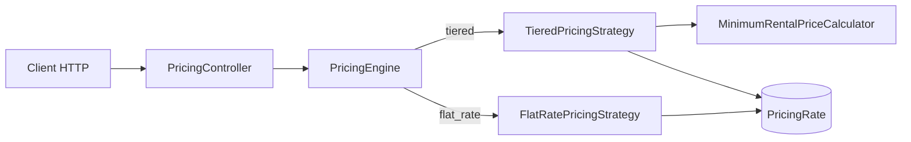

# Rental Pricing Engine

API back-end Symfony permettant de calculer le prix minimal d'une location de matériel entre deux dates.

Le catalogue prend en charge deux modèles de facturation : une tarification dégressive composée de forfaits jour, semaine (7 jours) et mois (30 jours), et une tarification fixe identique quelle que soit la durée. Pour le modèle dégressif, le moteur recherche la combinaison de forfaits la moins chère et peut retenir un forfait couvrant plus de jours que la période demandée.

Le projet utilise PHP 8.4, Symfony 7.4 LTS, Doctrine ORM, MySQL 8.4, Zenstruck Foundry, PHPUnit, PHPStan, PHP CS Fixer et Docker Compose.

## Installation et environnement

Prérequis : Git, Docker avec Docker Compose v2 et GNU Make. Les ports `8000` et `3306` doivent être disponibles. PHP, Composer, MySQL et Xdebug sont fournis par les conteneurs.

```bash
git clone https://github.com/nicolasstrady/RentalPricingEngine.git
cd RentalPricingEngine
cp .env.example .env
make rebuild
make install
make database
```

Sous l'invite de commandes Windows, utiliser `copy .env.example .env` à la place de `cp`.

`make database` supprime puis recrée la base principale, exécute les migrations Doctrine et charge le catalogue de démonstration avec Foundry. Toutes les données locales existantes sont donc remplacées. L'API est ensuite disponible sur <http://localhost:8000>.

| Commande | Action |
|---|---|
| `make up` | Démarrer les conteneurs |
| `make rebuild` | Reconstruire puis démarrer les conteneurs |
| `make down` | Arrêter les conteneurs |
| `make install` | Installer les dépendances Composer |
| `make database` | Recréer la base, migrer et charger les fixtures |
| `make database-create` | Créer uniquement la base principale |
| `make migrate` | Exécuter les migrations Doctrine |
| `make fixtures` | Recharger les fixtures Foundry |
| `make console` | Ouvrir la console Symfony |
| `make shell` | Ouvrir un shell dans le conteneur PHP |
| `make logs` | Suivre les logs Docker |
| `make test` | Préparer la base de test et lancer PHPUnit |
| `make quality` | Lancer Composer Validate, PHP CS Fixer, PHPStan et PHPUnit |
| `make coverage` | Générer le rapport de couverture avec Xdebug |

Le modèle de données repose sur deux entités : `Equipment` porte le nom et le modèle tarifaire du matériel, tandis que `PricingRate` associe un montant et éventuellement une durée à cet équipement. La durée vaut `1`, `7` ou `30` pour un tarif dégressif et `null` pour un forfait fixe.

Le catalogue fourni contient au moins un équipement pour chacun des modèles demandés :

| Équipement | Modèle | Tarifs en EUR |
|---|---|---|
| Perceuse | Dégressif | 1 jour : 20,10, 7 jours : 60,55, 30 jours : 200,99 |
| Ponceuse | Dégressif | 1 jour : 10, 7 jours : 90, 30 jours : 250 |
| Scie circulaire | Dégressif | 1 jour : 25, 7 jours : 100, 30 jours : 500 |
| Nettoyeur haute pression | Fixe | 150 par location |
| Shampouineuse | Fixe | 90 par location |

Une base suffixée par `_test` est préparée séparément pour PHPUnit afin de ne pas modifier les données de développement.

## API et règles métier

Toutes les routes renvoient du JSON.

| Méthode | Route | Résultat |
|---|---|---|
| `GET` | `/api/equipments` | Liste des équipements sans leurs tarifs |
| `GET` | `/api/equipments/{id}` | Détail d'un équipement avec ses tarifs |
| `POST` | `/api/equipments/{id}/pricing/calculate` | Prix minimal entre deux dates |

Après un chargement neuf des fixtures, cet appel calcule le prix de la perceuse pendant cinq jours :

```bash
curl --request POST \
  --url http://localhost:8000/api/equipments/1/pricing/calculate \
  --header "Content-Type: application/json" \
  --data '{
    "startDate": "2026-08-01",
    "endDate": "2026-08-05"
  }'
```

Réponse attendue :

```json
{
  "equipment": {
    "id": 1,
    "name": "Perceuse",
    "pricingModel": "tiered"
  },
  "startDate": "2026-08-01",
  "endDate": "2026-08-05",
  "durationInDays": 5,
  "amount": 60.55,
  "currency": "EUR"
}
```

Cinq journées coûteraient `100,50 EUR`. Le moteur choisit donc la semaine à `60,55 EUR`, même si elle couvre deux jours supplémentaires.

Les dates utilisent le format `YYYY-MM-DD` et la date de fin doit être postérieure ou égale à la date de début. La durée est inclusive : une location du 1er au 1er août dure un jour, et une location du 1er au 5 août dure cinq jours. Un mois tarifaire représente toujours 30 jours, et non un mois calendaire.

Les montants sont exprimés directement en euros avec des décimales, jamais en centimes entiers. Ils sont manipulés comme des `float` dans le domaine et dans les réponses API : `60.55` représente ainsi 60 euros et 55 centimes. Les tarifs et les résultats des calculs sont arrondis à deux chiffres après la virgule avec un arrondi commercial (`PHP_ROUND_HALF_UP`).

## Architecture

Le moteur applique le design pattern Strategy afin d'isoler chaque règle de tarification :

- `PricingStrategyInterface` définit le contrat commun ;
- `PricingEngine` sélectionne la stratégie compatible avec le modèle de l'équipement ;
- `TieredPricingStrategy` transforme les tarifs dégressifs en données utilisables par le calculateur ;
- `FlatRatePricingStrategy` retourne le forfait unique ;
- `MinimumRentalPriceCalculator` contient uniquement l'algorithme et ne dépend ni de Symfony, ni de Doctrine, ni du contrôleur.



Les stratégies sont automatiquement taguées dans `services.yaml` et injectées dans le moteur sous forme d'itérateur. Ajouter un modèle consiste à ajouter sa valeur dans `PricingModel`, implémenter `PricingStrategyInterface` et `supports()`, puis compléter les fixtures et les tests. La boucle de sélection de `PricingEngine` et la structure générale de l'API restent inchangées.

## Approche algorithmique

Un découpage glouton « mois, puis semaines, puis jours » ne garantit pas le prix minimal lorsque les tarifs ne sont pas proportionnels. Plusieurs semaines peuvent par exemple être moins chères qu'un mois, ou une semaine moins chère que cinq journées.

`MinimumRentalPriceCalculator` utilise donc une programmation dynamique itérative :

1. un tableau contient le meilleur coût connu pour chaque nombre de jours couverts ;
2. le coût de zéro jour est initialisé à zéro ;
3. depuis chaque durée atteignable, le calculateur essaie chacun des forfaits disponibles ;
4. le coût obtenu remplace le précédent uniquement s'il est inférieur ;
5. une couverture supérieure à la demande est ramenée à la durée demandée, ce qui autorise les forfaits plus longs ;
6. chaque somme intermédiaire est arrondie à deux décimales afin de neutraliser les imprécisions des nombres flottants ;
7. la dernière case contient ainsi le minimum absolu, également arrondi à deux décimales.

Cette méthode couvre aussi bien les combinaisons de mois, semaines et jours que la répétition d'un même forfait. Pour une durée demandée `D` et `R` tarifs disponibles, sa complexité est de `O(D × R)` en temps et `O(D)` en mémoire.

## Tests et qualité

La commande suivante exécute toutes les vérifications :

```bash
make quality
```

Les tests couvrent :

- les entités et leurs invariants ;
- le calculateur de prix minimal ;
- les stratégies fixe et dégressive ;
- la sélection des stratégies par le moteur ;
- les fixtures Foundry ;
- les endpoints, la sérialisation et la validation des dates.

Pour produire la couverture :

```bash
make coverage
```

Le résumé est affiché dans le terminal et le rapport HTML est disponible dans `var/coverage/index.html`. Xdebug est désactivé pendant l'utilisation ordinaire de l'API et activé uniquement pour cette commande.

## Limites et évolutions possibles

Le périmètre reste volontairement centré sur le sujet : montants en euros arrondis à deux décimales, périodes exprimées en dates, catalogue non paginé, absence d'administration et d'authentification. Pour des contraintes comptables plus strictes, un futur objet `Money` pourrait encapsuler les règles de précision tout en conservant des montants publics exprimés en euros. Une tarification horaire demanderait des date-times et une unité de durée explicite. Pour une mise en production, le serveur PHP intégré devrait être remplacé par une infrastructure adaptée et le format public des erreurs pourrait être uniformisé.
