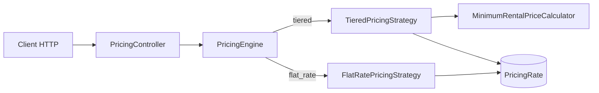

# Rental Pricing Engine

API back-end Symfony permettant de calculer le prix minimal d'une location de matériel entre deux dates.

Le catalogue prend actuellement en charge deux modèles de facturation :

- la tarification dégressive, composée de forfaits jour, semaine de 7 jours et mois de 30 jours ;
- la tarification fixe, dont le montant reste identique quelle que soit la durée de location.

Le moteur sélectionne la combinaison de forfaits la moins chère. Il peut facturer un forfait couvrant plus de jours que la durée demandée lorsque cette solution réduit le prix total.

## Stack technique

- PHP 8.4 ;
- Symfony 7.4 LTS ;
- Doctrine ORM et migrations ;
- MySQL 8.4 ;
- Zenstruck Foundry pour les factories et les fixtures ;
- PHPUnit 13, PHPStan et PHP CS Fixer ;
- Docker Compose ;
- Xdebug pour la couverture de code.

## Prérequis

L'environnement Docker fournit PHP, Composer et MySQL. Seuls les outils suivants sont nécessaires sur la machine hôte :

- Git ;
- Docker Desktop, ou Docker Engine avec Docker Compose v2 ;
- GNU Make.

Les ports suivants doivent être disponibles :

- `8000` pour l'API ;
- `3306` pour MySQL.

## Installation

Cloner le repository et entrer dans le projet :

```bash
git clone https://github.com/nicolasstrady/RentalPricingEngine.git
cd RentalPricingEngine
```

Créer le fichier d'environnement local :

```bash
cp .env.example .env
```

Sous l'invite de commandes Windows :

```bat
copy .env.example .env
```

Construire et démarrer les conteneurs, installer les dépendances, puis préparer les données :

```bash
make rebuild
make install
make database
```

`make database` exécute successivement :

1. la création de la base si elle n'existe pas ;
2. les migrations Doctrine ;
3. le chargement du catalogue Foundry.

L'API est ensuite disponible sur <http://localhost:8000>.

## Commandes principales

| Commande | Description |
|---|---|
| `make up` | Construit et démarre les conteneurs au premier plan |
| `make rebuild` | Reconstruit et démarre les conteneurs en arrière-plan |
| `make down` | Arrête les conteneurs sans supprimer les données |
| `make install` | Installe ou synchronise les dépendances Composer |
| `make database` | Crée la base, exécute les migrations et charge les fixtures |
| `make database-create` | Crée uniquement la base principale |
| `make migrate` | Exécute les migrations Doctrine |
| `make fixtures` | Recharge le catalogue de démonstration avec Foundry |
| `make console` | Ouvre la console Symfony |
| `make shell` | Ouvre un shell dans le conteneur PHP |
| `make logs` | Suit les logs Docker |
| `make test` | Prépare la base de test et exécute PHPUnit |
| `make analyse` | Exécute PHPStan |
| `make cs-check` | Vérifie le style sans modifier les fichiers |
| `make cs-fix` | Corrige automatiquement le style PHP |
| `make quality` | Valide Composer, le style, PHPStan et PHPUnit |
| `make coverage` | Exécute les tests avec Xdebug et génère le rapport de couverture |

Après une modification de `composer.json`, exécuter `make install`. Après une modification du `Dockerfile`, exécuter `make rebuild`.

## Base de données et fixtures

Le modèle repose sur deux entités :

- `Equipment` décrit un matériel et son modèle de tarification ;
- `PricingRate` associe à ce matériel un montant et, pour un tarif dégressif, une durée en jours.

Pour une tarification fixe, `durationInDays` vaut `null`, car le forfait s'applique à toute la location. Pour une tarification dégressive, les durées de référence sont `1`, `7` et `30` jours.

La commande explicitement prévue pour charger les données de démonstration est :

```bash
make fixtures
```

Le catalogue principal contient :

| Équipement | Modèle | Tarifs en EUR |
|---|---|---|
| Perceuse | Dégressif | 1 jour : 20, 7 jours : 60, 30 jours : 200 |
| Ponceuse | Dégressif | 1 jour : 10, 7 jours : 90, 30 jours : 250 |
| Scie circulaire | Dégressif | 1 jour : 25, 7 jours : 100, 30 jours : 500 |
| Nettoyeur haute pression | Fixe | 150 par location |
| Shampouineuse | Fixe | 90 par location |

Une base distincte, suffixée par `_test`, est créée automatiquement pour PHPUnit. Les tests ne modifient donc pas le catalogue de développement.

## API

Toutes les routes renvoient du JSON.

| Méthode | Route | Description |
|---|---|---|
| `GET` | `/api/equipments` | Liste les équipements sans le détail des tarifs |
| `GET` | `/api/equipments/{id}` | Retourne un équipement et ses tarifs |
| `POST` | `/api/equipments/{id}/pricing/calculate` | Calcule le prix minimal entre deux dates |

La liste du catalogue permet de retrouver les identifiants disponibles :

```bash
curl http://localhost:8000/api/equipments
```

### Exemple de calcul demandé par le sujet

Après un chargement neuf des fixtures, la perceuse porte normalement l'identifiant `1`. Si nécessaire, utiliser l'identifiant retourné par la route de catalogue.

```bash
curl --request POST \
  --url http://localhost:8000/api/equipments/1/pricing/calculate \
  --header "Content-Type: application/json" \
  --data '{
    "startDate": "2026-08-01",
    "endDate": "2026-08-05"
  }'
```

Réponse attendue :

```json
{
  "equipment": {
    "id": 1,
    "name": "Perceuse",
    "pricingModel": "tiered"
  },
  "startDate": "2026-08-01",
  "endDate": "2026-08-05",
  "durationInDays": 5,
  "amount": 60,
  "currency": "EUR"
}
```

Les cinq tarifs journaliers coûteraient `100 EUR`. Le moteur choisit donc le forfait semaine à `60 EUR`, même s'il couvre deux jours supplémentaires.

Les dates doivent respecter le format `YYYY-MM-DD`, et la date de fin doit être postérieure ou égale à la date de début.

## Hypothèses métier

### Durée inclusive

Les deux dates appartiennent à la période facturée :

```text
duration = différence entre les dates + 1 jour
```

Une location du `2026-08-01` au `2026-08-01` dure donc un jour. Une location du `2026-08-01` au `2026-08-05` dure cinq jours.

### Mois contractuel

Le forfait mois correspond exactement à 30 jours. Il ne représente pas un mois calendaire de longueur variable.

### Dépassement autorisé

Un forfait peut dépasser la durée réelle. Le calcul cherche le coût minimal pour couvrir **au moins** la durée demandée, conformément à l'exemple donné dans le sujet.

### Convention monétaire

Dans cette version, `amount` contient un nombre entier d'euros et `currency` vaut `EUR`. Aucun calcul n'utilise de nombre flottant.

Pour une application de production acceptant des fractions d'euro, le modèle devrait évoluer vers des unités monétaires mineures, par exemple des centimes, ou vers un objet `Money` dédié.

## Architecture

Le moteur applique le Strategy pattern :

- `PricingStrategyInterface` définit le contrat commun ;
- `TieredPricingStrategy` adapte les tarifs dégressifs et délègue l'optimisation au calculateur ;
- `FlatRatePricingStrategy` renvoie le forfait unique ;
- `PricingEngine` sélectionne la stratégie compatible avec le modèle de l'équipement ;
- `MinimumRentalPriceCalculator` reste indépendant de Symfony, Doctrine et des contrôleurs.

Les stratégies sont automatiquement taguées par Symfony grâce à `services.yaml`, puis injectées dans `PricingEngine` sous forme d'itérateur. Ajouter une stratégie ne nécessite donc pas de modifier la boucle de sélection du moteur.



Cette séparation garde les responsabilités distinctes :

- le contrôleur valide l'entrée HTTP et transforme les dates en durée inclusive ;
- le moteur choisit une stratégie ;
- chaque stratégie interprète son modèle tarifaire ;
- le calculateur résout uniquement le problème d'optimisation.

## Approche algorithmique

La stratégie dégressive ne procède pas par découpage glouton « mois, puis semaines, puis jours ». Cette approche pourrait manquer une combinaison moins chère lorsque les tarifs ne sont pas proportionnels.

Le calculateur utilise une programmation dynamique itérative :

1. `minimumCosts[0]` vaut `0` ;
2. pour chaque durée déjà atteignable, chaque forfait est essayé ;
3. le nouveau coût est conservé uniquement s'il améliore le minimum connu ;
4. toute couverture supérieure à la demande est ramenée à la durée demandée, ce qui autorise un forfait plus long ;
5. la dernière case contient le minimum absolu.

Pour une durée `D` et `R` tarifs, la complexité est :

- temps : `O(D × R)` ;
- mémoire : `O(D)`.

Cette approche couvre notamment les situations suivantes :

- une semaine moins chère que cinq journées ;
- plusieurs petits forfaits moins chers qu'un forfait long ;
- plusieurs semaines moins chères qu'un mois ;
- un forfait dépassant de quelques jours la période demandée.

## Ajouter une stratégie

Une nouvelle stratégie doit :

1. ajouter le nouveau modèle dans l'enum `PricingModel` ;
2. implémenter `PricingStrategyInterface` ;
3. indiquer le modèle pris en charge avec `supports()` ;
4. implémenter son propre calcul dans `calculate()` ;
5. compléter les fixtures et les tests associés.

Le tag Symfony est ajouté automatiquement. `PricingEngine` et la structure générale de l'API restent inchangés.

Une tarification horaire demanderait néanmoins d'étendre la précision des entrées, actuellement limitées aux dates, et de représenter explicitement l'unité des durées tarifaires.

## Tests et qualité

Exécuter l'ensemble des vérifications avant une contribution :

```bash
make quality
```

Les tests couvrent :

- les entités et leurs invariants ;
- le calculateur de prix minimal ;
- les stratégies fixe et dégressive ;
- la sélection des stratégies par le moteur ;
- les fixtures Foundry ;
- les endpoints, la sérialisation et la validation des dates.

Pour produire la couverture :

```bash
make coverage
```

Le résumé est affiché dans le terminal et le rapport HTML est généré dans `var/coverage/index.html`. Xdebug reste désactivé pendant les requêtes ordinaires et n'est activé que pour cette commande.

## Limites et évolutions possibles

- les montants sont limités aux euros entiers ;
- l'API manipule des dates, pas encore des heures ;
- le catalogue n'est pas paginé et ne propose pas d'administration CRUD ;
- aucune authentification ni autorisation n'est implémentée ;
- le serveur PHP intégré au conteneur convient au développement, mais devrait être remplacé par une infrastructure de production ;
- une future tarification horaire nécessiterait des date-times et une unité de durée explicite ;
- un format d'erreur public commun pourrait être ajouté si l'API devait garantir ce contrat à plusieurs clients.
